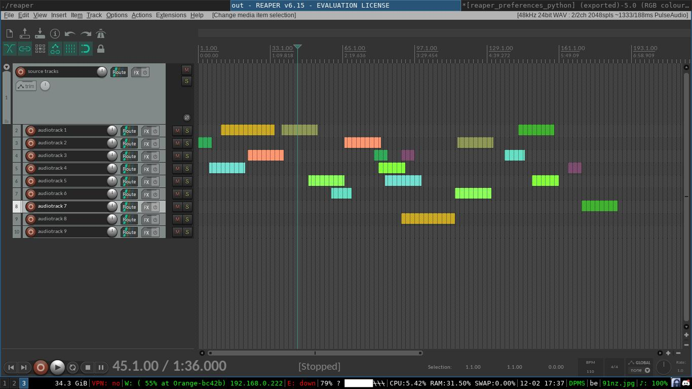
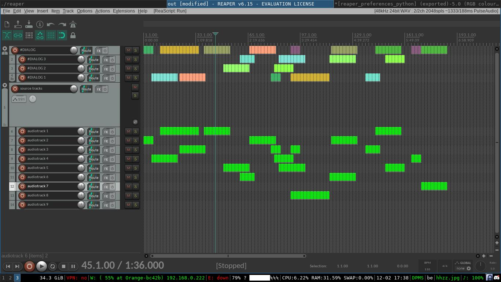

# Move to bus - metapackage

This tool supplies multiple scripts that copy selected items to predefined busses.
It is currently in alpha stage so some behavior might be off.
Do not hesitate to contact me in case you find issues.
The current predefined busses are:

* #DIALOG
* #MUSIC

Addionally the selected items are colored green and muted.
If items would overlap on the bus, a child is created and the item is moved there.

