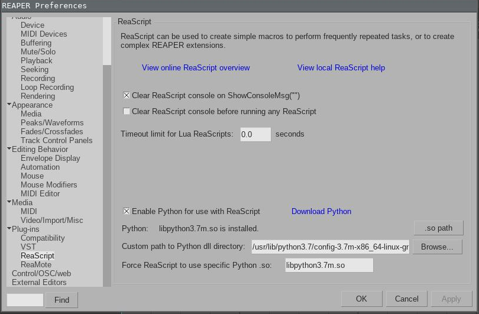
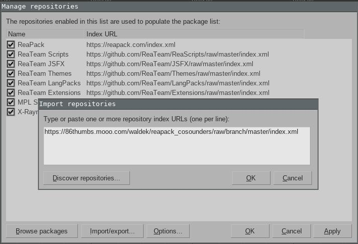
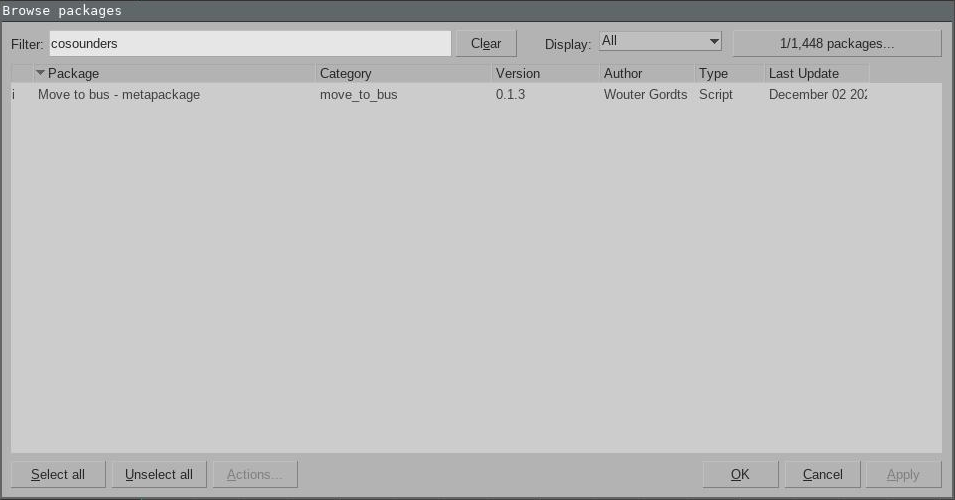

# Cosounders and Demute Reapack collection

This repository houses all scripts for Cosounders and Demute.

## Installation

For those with coding/git experience the installation procedure might seem a bit counter intuitive.
You **do not** need to clone this repository locally.
Reapack uses git for versioning and code hosting but all installation and updates are done through the GUI inside of reaper.

The full installation procedure has the following step.
Please read the steps before continuing.

1. install reaper which can be found [here](https://www.reaper.fm/download.php)
2. install reapack which can he found [here](https://reapack.com/) and installation instructions [here](https://reapack.com/user-guide#installation)
3. install python3 which can be found [here](https://www.python.org/downloads/)
4. verify that reaper can find the **python3.dll** you installed
2. add this repository to reapack (more information below)

The most cumbersome part is to make reaper be aware of your python3 installation.
You can verify this via the reaper preferences but it has been pointed out that reaper can not always find the right python3.dll file on Windows.
It is a recurring issue that the reaper community is well aware of and some information can be found in [this thread](https://forum.cockos.com/showthread.php?t=127110).
Some pointers from personal experience are listed below but your milage may vary.

* python3 is probably installed in you user **AppData** folder
	* **for example:** C:\Users\$USERNAME\AppData\Local\Programs\Python\Python39
* there are probably 2 different dll files in the python folder
	* try specifying with both **python3.dll** and **python3X.dll** and see which one works
	* try with and without the **.dll** extension suffix
* the restart reaper prompts is not always needed
* verify by creating a new **.py** script via the **action list** menu (if .py is in the drop-down menu, it will work)



Once you successfully installed reapack you need to add this repository to the list of sources.
This is done by add the following repository to reapack.
The XML file acts as a database containing all script and versioning information that reapack needs to install our extensions.
It is updated at each script change committed to this git but the URL path remains the same.

```
https://86thumbs.mooo.com/waldek/reapack_cosounders/raw/branch/master/index.xml
```



You should now find all the scripts in the reapack browser window.



Once you install a script or metapackages the new actions will be found in the **action list**.
If the newly added action **do not show up** your python installation is probably not correct.
See the pointers above to troubleshot the issue.

## Details

Details out packages and scripts can be found in the corresponding folders.

## Code notes

* general information on reascript can be found [here](https://www.reaper.fm/sdk/reascript/reascript.php).
* extensive information on all things [reascript](https://github.com/ReaTeam/Doc)
